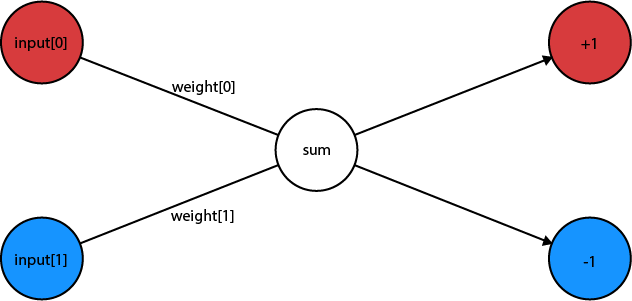

[View on GitHub Pages](https://rewforen.github.io/Perceptron/)  

# Perceptron

The simplest form of a Neural Network.  
This Neural Network consists of two inputs and a single node, along with two weights.  
In this project the AI solves the equation of a linear line that is fixed at the origin.  
 
 
Model of this Neural Network:  

